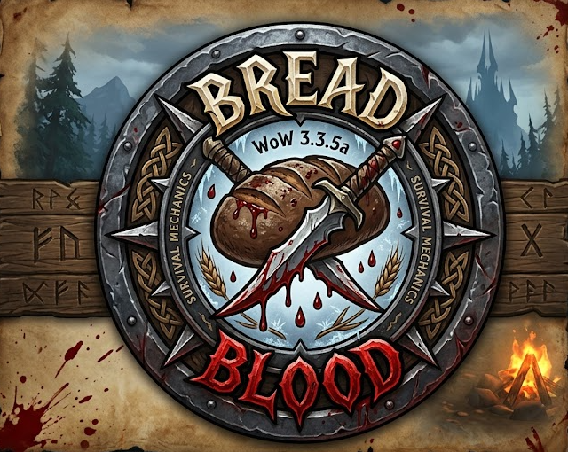

  

# Bread & Blood - Survival Immersion for WoW 3.3.5a

**Bring true survival to Azeroth.**

**Bread & Blood** completely transforms your World of Warcraft experience into a true survival adventure. Designed for roleplayers and hardcore players alike, this addon introduces three core needs your character must manage: **Hunger**, **Thirst**, and **Fatigue**. 

> ⚠️ **100% Client-Side:** This addon runs completely on your client. It requires no server-side modifications, making it **fully compatible with any WotLK 3.3.5a server** you play on.

No longer is eating and drinking just for restoring health and mana; it is now essential for your sheer survival. Neglect your basic needs, and your character will suffer severe immersive penalties, from debilitating hallucinations to losing focus in combat.

---

## Core Survival Mechanics

* **Hunger:** Slowly depletes over time. Eating food restores your hunger level based on the quality of the meal.
* **Thirst:** Slowly depletes over time. Drinking beverages restores your thirst level.
* **Fatigue:** Depletes as you adventure. You can recover fatigue by resting at an Inn, sitting by a cozy campfire, or using the `/sleep` or `/sit` emotes.

  

---

## Immersive Interface & Penalties

As your survival stats drop below critical thresholds, your character will begin to suffer. Bread & Blood dynamically alters your user interface to reflect your deteriorating physical state:

* **Vision Loss:** Your Action Bars, Player/Target Unit Frames, and Minimap will begin to fade out as your condition worsens.
* **Exhaustion:** If you are too tired or thirsty, you may lose the ability to focus on the World Map. If fatigue reaches zero, your character will collapse and be forced to sit down.
* **Combat Inefficiency:** Starvation or extreme fatigue can cause your hands to shake, giving your spells a random chance to fizzle and fail in the heat of battle. *(Note: This is a purely cosmetic, **fake error for RP immersion** to mess with your perception. It does not actually alter your real character stats or spell values).*
* **Audio & Visual Cues:** Experience custom sound effects like stomach growls and yawns, screen vignettes, and a blinking effect when your eyes start closing from exhaustion. On-screen warning indicators will pulse when your stats are critically low.

### Screenshots

  

  
  

---

## Fully Customizable Settings

  

The addon includes a comprehensive options menu (accessible via `ESC -> Interface -> AddOns` or the `/bnb` command), allowing you to tailor the survival experience to your exact preferences:

* **Penalty Assignments:** Choose exactly which stat (Hunger, Thirst, Fatigue, or Disabled) triggers each UI penalty (Action Bars, Unit Frames, Minimap, World Map, Combat Errors).
* **Custom Thresholds:** Fine-tune the exact percentage at which each penalty begins to take effect.
* **Adjustable Rates:** Control the difficulty by changing the exact rate at which Hunger, Thirst, and Fatigue deplete every minute.

---

## Commands

You can use the following commands in-game to manage or test the addon:

| Command | Description |
| :--- | :--- |
| `/bnb` | Opens the settings menu instructions. |
| `/bnb test [hunger] [thirst] [fatigue]` | Instantly sets your stats to test UI penalty configurations (e.g., `/bnb test 20 20 20`). |

---

## Installation

1. Go to the **Releases** section on the right side of this GitHub page.
2. Download the latest **`BreadAndBlood.zip`** file.
3. Extract the ZIP file and place the `BreadAndBlood` folder directly into your WoW directory:  
   `World of Warcraft\Interface\AddOns\`
4. Log into the game, and make sure the addon is enabled in your AddOns list at the character selection screen.

> **Survival Tip:** Survive the harsh environments of Azeroth, remember to pack your rations, and pitch a tent by the fire. Your life depends on it!
